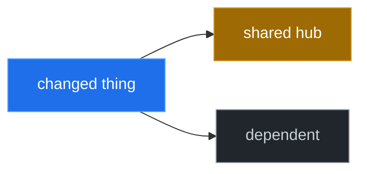

# Mermaid role colors (canonical)

When drawing Mermaid diagrams for teaching, PRs, or HUDs, use role colors by default and pair every colored diagram with a one-line legend.

## Canonical legend

| Role | Meaning | `classDef` name | Fill (dark-theme friendly) |
|---|---|---|---|
| **seed** | The thing that changed / the starting point you care about | `seed` | `#1f6feb` (blue) |
| **danger** | High-risk / shared hub / API-schema-config / critical node | `danger` | `#9e6a03` (amber) |
| **downstream** | Depends on / affected by the seed (blast radius) | `downstream` | `#21262d` (gray) |

Optional: omit a fourth color; prefer silence over extra colors unless it clarifies.

## Required pattern

Use `classDef` + `class` rather than per-node `style`. Example:

Legend line (chat or markdown): **blue** = seed (changed), **amber** = Danger Zone / critical, **gray** = downstream.

## Rules

1. Prefer `classDef` + `class` over per-node `style`.
2. Colors are presentation-only — never invent nodes or edges to make a diagram prettier.
3. If a node qualifies as both seed and danger, show **seed** (what changed) preferentially.
4. Always label boxes and arrows; avoid unlabeled abstractions.
5. For non-blast-radius diagrams (pipelines, auth flows), use the same three roles with a custom legend mapping to the domain.

## Focus product compatibility

If a product emits Mermaid `classDef`s (e.g., Focus HUD), match that legend so diagrams remain consistent between PRs and chat screenshots.
